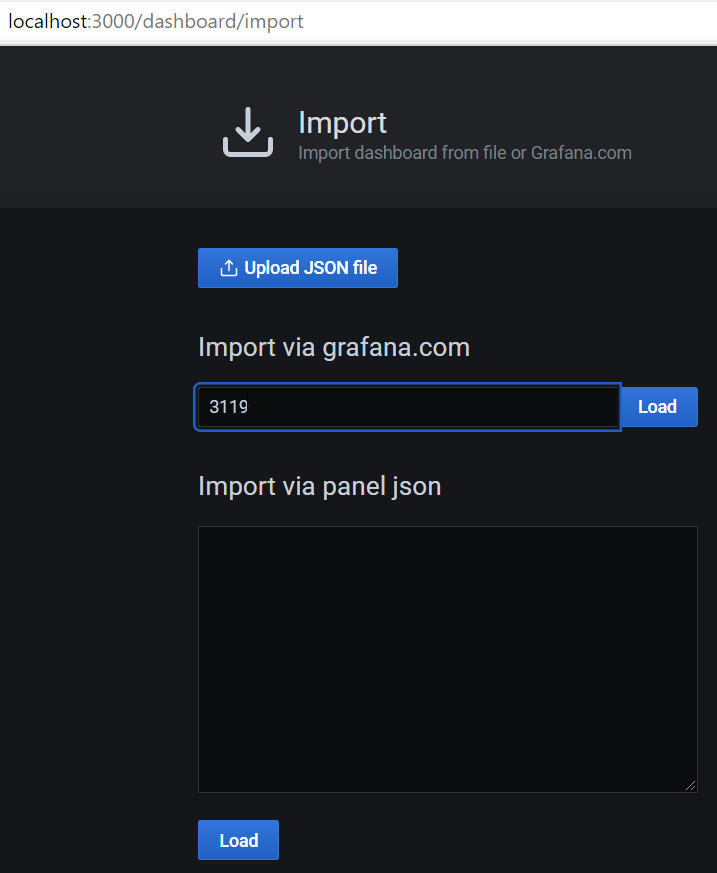
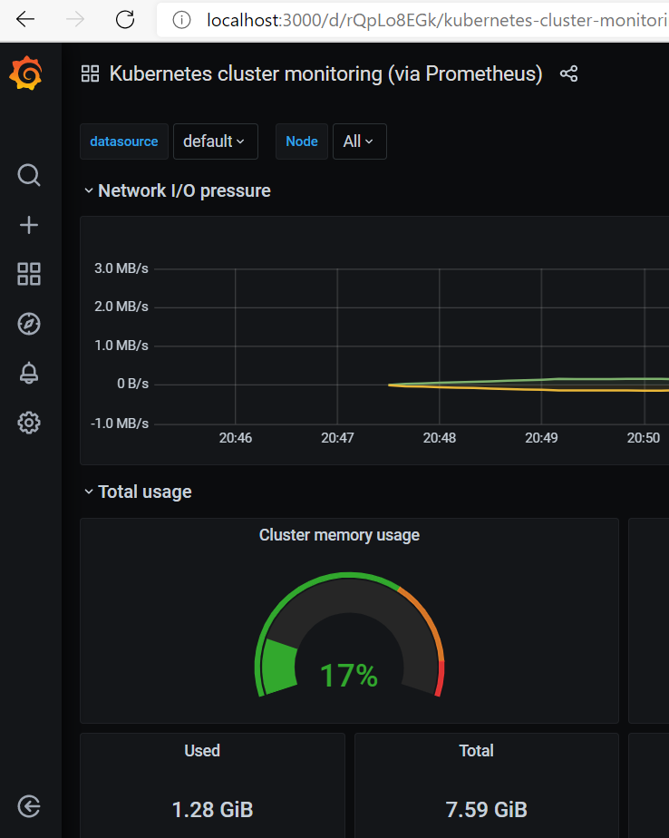
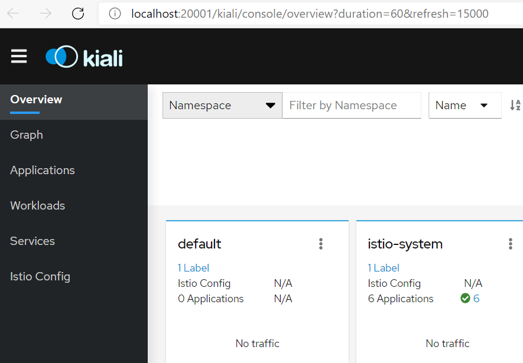

# 3. Monitoring and Telemtry
When installing istio using `demo` profile, it installed monitoring tools such as `grafana`, `prometheus`, `kiali`, `jaeger`. We will cover these a bit more in ch10.

```sh
# list pods
kubectl get pod -n istio-system

# output
NAME                                    READY   STATUS    RESTARTS   AGE
istio-egressgateway-7c6c6cd8b9-c87lz    1/1     Running   0          22m
istio-ingressgateway-5d869f5bbf-bvpxs   1/1     Running   0          22m
istiod-648555b9b7-qgtg9                 1/1     Running   0          23m
```


## 3.1 Check Grafana dashboard
```
istioctl dashboard grafana
```

## Grafana Dashboard Walkthrough
Create kubernetes dashboard on grafana by:
+ icon > type `3119` dashboard ID > Select ‘Prometheus’ as the endpoint under prometheus data sources drop down.




In the web UI, you can see all the targets and metrics being monitored by grafana:



## Practically useful Grafana community dashboards 

- [K8 Cluster Detail Dashboard](https://grafana.com/grafana/dashboards/10856)
- [K8s Cluster Summary](https://grafana.com/grafana/dashboards/8685)
- [Kubernetes cluster monitoring](https://grafana.com/grafana/dashboards/315)


## 3.2 Check Kiali Dashboard 
```
istioctl dashboard kiali
```

Username and password is `admin` by default.



Will walk through Kiali more in later chapters when we deploy applications.