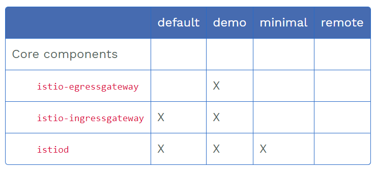
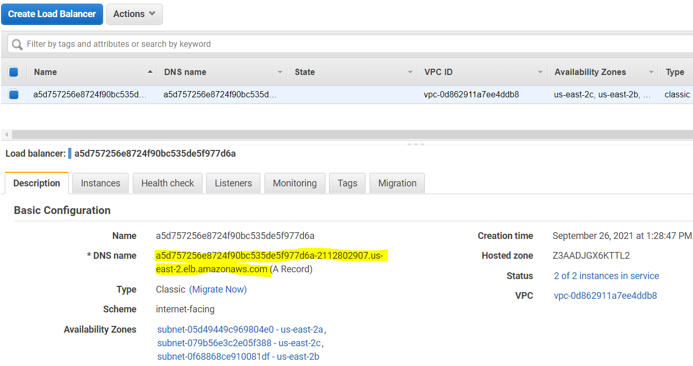
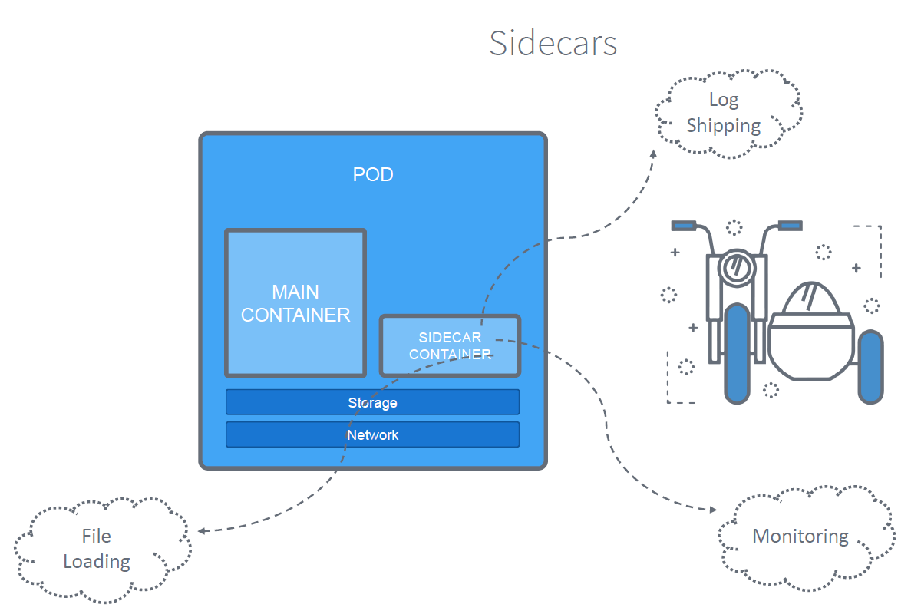
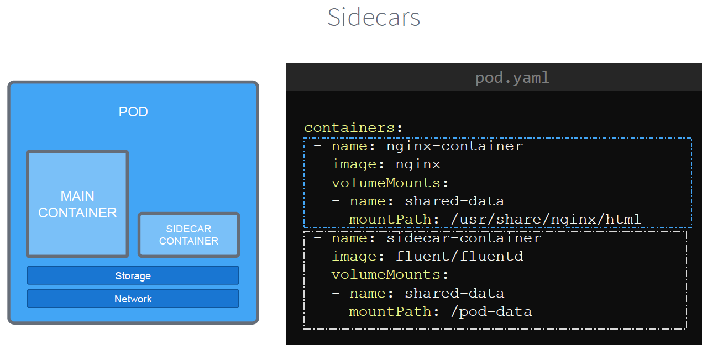

# 2. Install Istio
# 2.1 Install Istio using istioctl
```sh
# first install istioctl CLI
URL: https://istio.io/latest/docs/ops/diagnostic-tools/istioctl/

curl -L https://istio.io/downloadIstio | ISTIO_VERSION=1.11.3 sh -
cd istio-1.11.3
echo "export PATH=$PWD/bin:$PATH" >> ~/.bash_profile

# open new shell to load updated PATH variable
```


# 2.2 Install Istio to K8s cluster using istio config profile
Ref: https://istio.io/latest/docs/setup/additional-setup/config-profiles/

There are a few preset profiles we can install:
- default
- dmeo
- minimal
- etc



We will install `demo` profile, which comes with ingress/egress gateways, as well as grafana, kiali, jaegger (request tracing), and prometheus monitoring/metrics dashboards.
```sh
# display the list of available profiles
istioctl profile list

# save config into yaml
istioctl profile dump demo > profile_demo_config.yaml
```

```sh
# generate a k8s manifest for profile "demo" before installation
istioctl manifest generate \
  --set profile=demo \
  --set values.gateways.istio-ingressgateway.sds.enabled=true \
  > generated-manifest-demo.yaml
```

Install/update istio (won't work on v1.6)

~~kubectl apply -f generated-manifest-demo.yaml~~
```sh
# note: "istioctl manifest apply" works for both v1.5 and v1.6, but will be deprecated from v1.7 in favor of istioctl install
<!-- istioctl manifest apply \
  --set profile=demo \
  --set values.gateways.istio-ingressgateway.sds.enabled=true  -->

# use "istioctl install" instead
istioctl install --set profile=demo -y
```

Output
<details><summary>show</summary><p>

```sh
✔ Istio core installed                                                                          ✔ Istiod installed  
✔ Ingress gateways installed
✔ Egress gateways installed                                                                     ✔ Addons installed                                                                              ✔ Installation complete
```
</p></details>


Analyze and detect potential issues with your Istio configuration
```sh
istioctl analyze --all-namespaces

# output
Warn [IST0102] (Namespace default) The namespace is not enabled for Istio injection. Run 'kubectl label namespace default istio-injection=enabled' to enable it, or 'kubectl label namespace default istio-injection=disabled' to explicitly mark it as not needing injection
Warn [IST0102] (Namespace kube-node-lease) The namespace is not enabled for Istio injection. Run 'kubectl label namespace kube-node-lease istio-injection=enabled' to enable it, or 'kubectl label namespace kube-node-lease istio-injection=disabled' to explicitly mark it as not needing injection
Error: Analyzers found issues when analyzing all namespaces.
See https://istio.io/docs/reference/config/analysis for more information about causes and resolutions.
```

Show objects created
```sh
kubectl get pod,svc -n istio-system

# output
NAME                                        READY   STATUS    RESTARTS   AGE
pod/istio-egressgateway-5fdc76bf94-lkmj8    1/1     Running   0          5m55s
pod/istio-ingressgateway-6bd7764b48-kv9f6   1/1     Running   0          5m55s
pod/istiod-675949b7c5-ml5gc                 1/1     Running   0          6m7s

NAME                           TYPE           CLUSTER-IP       EXTERNAL-IP                                                               PORT(S)
                                                       AGE
service/istio-egressgateway    ClusterIP      10.100.233.246   <none>                                                                    80/TCP,443/TCP        
                                                       5m55s
service/istio-ingressgateway   LoadBalancer   10.100.236.78    a5d757256e8724f90bc535de5f977d6a-2112802907.us-east-2.elb.amazonaws.com   15021:32297/TCP,80:32369/TCP,443:31035/TCP,31400:30002/TCP,15443:31727/TCP   5m55s
service/istiod                 ClusterIP      10.100.243.65    <none>                                                                    15010/TCP,15012/TCP,443/TCP,15014/TCP                                        6m6s                                         
```


Notice a service `istio-ingressgateway` in `istio-system` namespace created AWS ELB of type classic load balancer
```
service/istio-ingressgateway   LoadBalancer   10.100.236.78    a5d757256e8724f90bc535de5f977d6a-2112802907.us-east-2.elb.amazonaws.com   15021:32297/TCP,80:32369/TCP,443:31035/TCP,31400:30002/TCP,15443:31727/TCP   5m55s
```

Check AWS ELB created by istio ingress gateway service




Also notice a pod `istiod-675949b7c5-ml5gc`. 
This is the pod that contains istio pilot (service discovery), Galley (config), sidecar injector, that is `istiod`.
> istiod unifies functionality that Pilot, Galley, Citadel and the sidecar injector previously performed, into a single binary


# 2.3 Enable Istio Sidecar Injection 

Add a namespace label to instruct Istio to automatically inject Envoy sidecar proxies when you deploy your application later




```sh
# first describe default namespace
kubectl describe ns default

# output
Name:         default
Labels:       <none>
Annotations:  <none>
Status:       Active
No resource quota.
No resource limits.

# enable istio sidecar injection by adding a label
kubectl label namespace default istio-injection=enabled

# verify label is added
# output
Name:         default
Labels:       istio-injection=enabled
Annotations:  <none>
Status:       Active
No resource quota.
No resource limits.

# to disable
kubectl label namespace default istio-injection-
```

# Uninstall Istio #


```sh
istioctl manifest generate \
    --set profile=demo \
    | kubectl delete -f -
```

# Uninstall EKS Kubernetes Cluster #

```sh
eksctl delete cluster kombs-eks
```