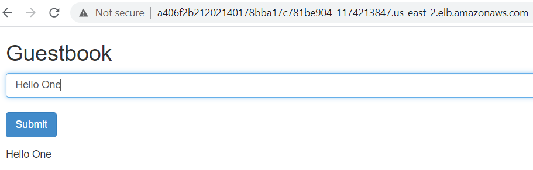
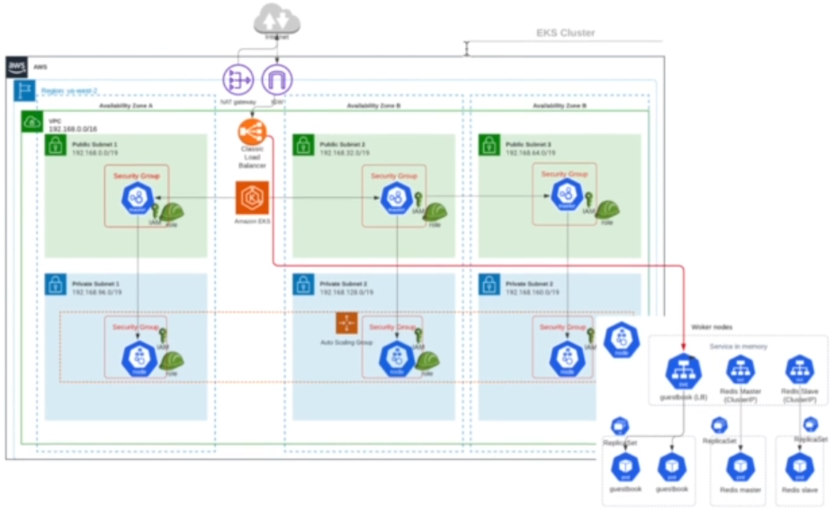
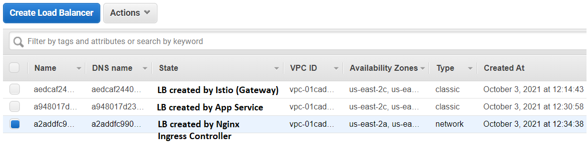
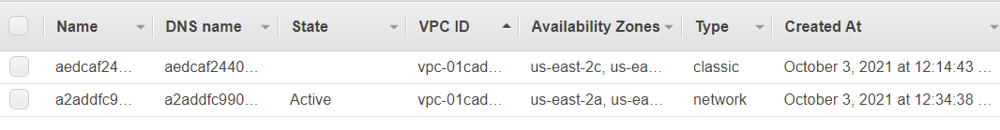
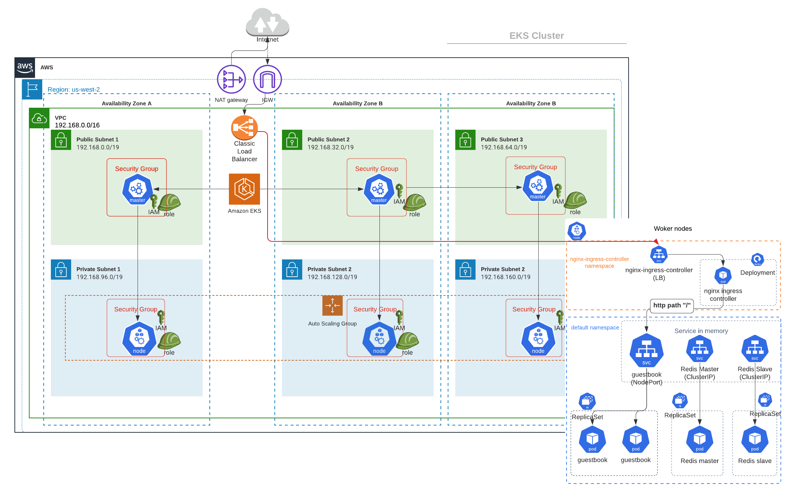
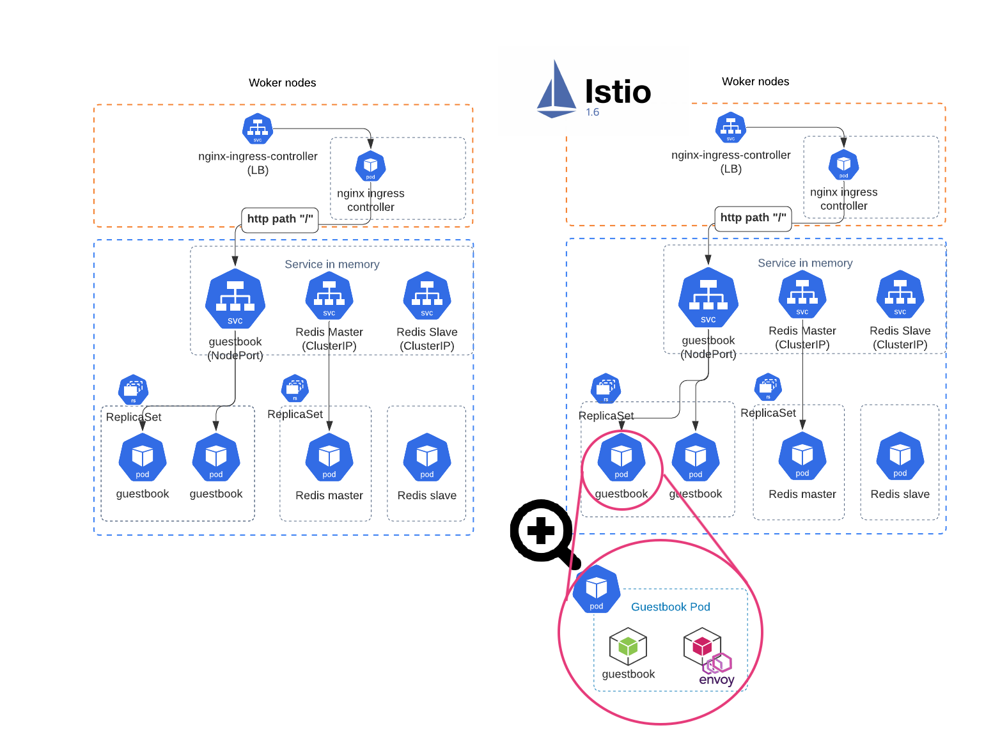

# 4. Deploy Sample App to EKS and Expose Service using Ingress

Refs: 
- https://github.com/kubernetes/examples/tree/master/guestbook/all-in-one


Frontend PHP app
- load balanced by public ELB
- read request load balanced to multiple slaves
- write request to a single master

Backend Redis
- single master (write)
- multi slaves (read)
- slaves sync continuously from master


```
kubectl apply -f guestbook-all-in-one.yaml
```

## 4.4 Get external ELB DNS
```sh
echo $(kubectl  get svc frontend | awk '{ print $4 }' | tail -1):$(kubectl  get svc frontend | awk '{ print $5 }' | tail -1 | cut -d ":" -f 1)

# output
a8274ce21a7f94416a5b6214f6f50205-1187236704.us-east-2.elb.amazonaws.com:80
```

Visit it from browser __after 3-5 minutes when ELB is ready__




## 4.5 What Just Happened?!



## 4.6 Install Nginx Ingress Controller
```

Refer: https://github.com/kubernetes/ingress-nginx/tree/main/deploy/static/provider/aws

kubectl -f https://raw.githubusercontent.com/kubernetes/ingress-nginx/main/deploy/static/provider/aws/deploy.yaml create

kubectl -n ingress-nginx get pods,svc,deploy

```
Output
```bash
NAME                                            READY   STATUS      RESTARTS   AGE
pod/ingress-nginx-admission-create-b2lwd        0/1     Completed   0          3m28s
pod/ingress-nginx-admission-patch-6tj9q         0/1     Completed   0          3m28s
pod/ingress-nginx-controller-6b969597bc-2hksv   1/1     Running     0          3m34s

NAME                                         TYPE           CLUSTER-IP       EXTERNAL-IP                                                                     PORT(S)                      AGE
service/ingress-nginx-controller             LoadBalancer   10.100.115.179   a2addfc9902e244d09dedfff896ebed5-5596a689663d740f.elb.us-east-2.amazonaws.com   80:31134/TCP,443:31504/TCP   3m36s
service/ingress-nginx-controller-admission   ClusterIP      10.100.140.133   <none>                                                                          443/TCP                      3m37s

NAME                                       READY   UP-TO-DATE   AVAILABLE   AGE
deployment.apps/ingress-nginx-controller   1/1     1            1           3m36s

```
Loadbalancers created so far:


## 4.7 Create Ingress resource for L7 load balancing by http hosts & paths

[ingress.yaml](ingress.yaml)
```yaml
apiVersion: networking.k8s.io/v1
kind: Ingress
metadata:
  name: frontend
  annotations:
    kubernetes.io/ingress.class: "nginx"
    nginx.ingress.kubernetes.io/rewrite-target: /
spec:
  rules:
  - http:
      paths:
      - path: /
        pathType: Prefix
        backend:
          service:
            name: frontend
            port:
              number: 80
```

Create ingress resource
```bash
kubectl apply -f ingress.yaml
```

Get the public DNS of AWS ELB created from the `nginx-ingress-controller-controller` service
```bash
kubectl  get svc ingress-nginx-controller -n ingress-nginx| awk '{ print $4 }' | tail -1
```

Output
```bash
# visit this from browser
a2addfc9902e244d09dedfff896ebed5-5596a689663d740f.elb.us-east-2.amazonaws.com
```


## 4.8 Delete AWS ELB created by K8s Service of type LoadBalancer
Now modify `guestbook` service type from `LoadBalancer` to `NodePort`.

First get yaml 
```bash
kubectl get svc frontend -o yaml
```

Strip out `status` etc that are added after created
[service_guestbook_nodeport.yaml](service_guestbook_nodeport.yaml)
```
apiVersion: v1
kind: Service
metadata:
  name: frontend
  labels:
    app: guestbook
    tier: frontend
spec:
  # comment or delete the following line if you want to use a LoadBalancer
  type: NodePort 
  # if your cluster supports it, uncomment the following to automatically create
  # an external load-balanced IP for the frontend service.
  # type: LoadBalancer
  ports:
  - port: 80
  selector:
    app: guestbook
    tier: frontend
```

Delete the existing `guestbook` service as service is immutable
```bash
kubectl -f service_guestbook_nodeport.yaml delete --force
```

Then apply new service
```bash
kubectl -f service_guestbook_nodeport.yaml create
```

Check services in `default` namespace
```bash
$ kubectl get svc

NAME           TYPE        CLUSTER-IP      EXTERNAL-IP   PORT(S)        AGE
frontend       NodePort    10.100.240.51   <none>        80:31366/TCP   37s
kubernetes     ClusterIP   10.100.0.1      <none>        443/TCP        81m
redis-master   ClusterIP   10.100.153.87   <none>        6379/TCP       47m
redis-slave    ClusterIP   10.100.69.155   <none>        6379/TCP       47m

```
Now check the Loadbalancers:


Lastly, check ingress controller's public DNS is reachable from browser
```bash
# visit the URL from browser
kubectl  get svc ingress-nginx-controller -n ingress-nginx| awk '{ print $4 }' | tail -1
```

## 4.9  What Just Happened?
1. Replaced `guestbook` service of type `LoadBalancer` to of `NodePort`
2. Front `guestbook` service with `nginx-ingress-controller` service of type `LoadBalancer`
3. `nginx-ingress-controller` pod will do L7 load balancing based on HTTP path and host
4. Now you can create multiple services and bind them to one ingress controller (one AWS ELB)

__Before Ingress__


__After Ingress__



__With Istio Enabled__

